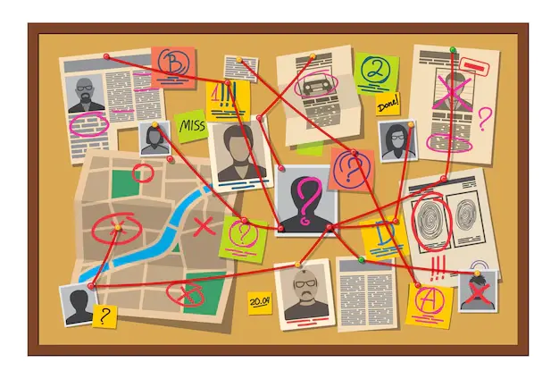

# echo-trace-matrix
Sistema de mapeamento de conversas gravadas em áudio ou vídeo para investigação criminal ou simplesmente relacionar melhor os assuntos abordados numa aula extensa.

## O que esse nome quer dizer esse nome?
**Echo (Eco):** Faz referência ao áudio ou vídeo gravado, como um eco das informações capturadas.

**Trace (Traço):** Refere-se às conexões e evidências traçadas a partir das gravações.

**Matrix:** Sugere uma estrutura ou rede de informações interconectadas, representando as ligações complexas no quadro de crime.

## Objetivo

Fazer algo parecido com esses sistemas visuais:

**[Interligado - Racha Cuca](https://rachacuca.com.br/raciocinio/interligado/)**

## Passos pensados
- [ ] Pagina para subir vídeos ou áudios
- [ ] Reconhecimento de voz e interlocutores em conversas
- [ ] Transcrição de fala
- [ ] Relacionamento de dados com similaridade, nomes pessoais e sinônimos
- [ ] Buscar trechos de falas baseado em consultas escritas e marcar isso na linha do tempo da mídia reproduzida
